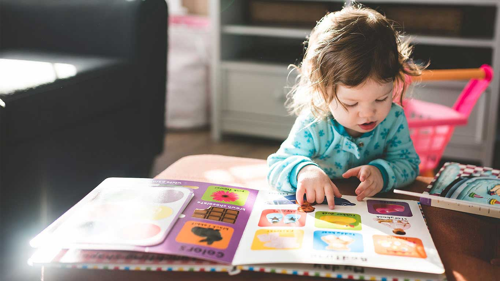

# Happy Toddlers Kindergarten

> **Our Vision:** To provide a strong foundation that stimulates early learning and child care experiences, promoting excellence in child growth and development.

A modern, responsive website for **Happy Toddlers Kindergarten Konge** — a kindergarten and daycare in Kampala, Uganda.

---

## 📸 Screenshots

### Homepage

*Hero section featuring our welcoming message for families in Kampala*


*"Where Happy Learning Begins" — our second hero slide*

---

## ✨ Features

- **Responsive design** — Works on desktop, tablet, and mobile
- **School facilities** — Transport, outdoor play, healthy meals
- **Our classes** — Art, Color Management, Computer Knowledge, Language, Religion & History, General Knowledge
- **Popular teachers** — Meet our dedicated team
- **Enrollment** — Appointment form for new families
- **Contact** — Location, phone, email, WhatsApp

---

## 📍 Location

**12b Lukuli 9565, Kampala, Uganda**  
📞 +256 775036505 | ✉️ happytoddlers@gmail.com

---

## 🛠️ Tech Stack

- HTML5, CSS3, JavaScript
- Bootstrap 5
- Owl Carousel
- Font Awesome & Bootstrap Icons
- WOW.js (scroll animations)

---

## 🚀 How to Run Locally

1. Clone the repository:
   ```bash
   git clone https://github.com/codetherapistpita-oss/happytoddlerskindergarten.git
   ```
2. Open `index.html` in your browser, or run with a local server (e.g. XAMPP, Live Server).

---

## 📷 Adding More Screenshots

To add more screenshots to this README:

1. Take a screenshot of any page (e.g. `Win + Shift + S` on Windows, or browser DevTools).
2. Save it in the `screenshots/` folder (e.g. `screenshots/classes-page.png`).
3. Add it to this README using:
   ```markdown
   
   ```
4. Commit and push:
   ```bash
   git add screenshots/ README.md
   git commit -m "Add new screenshots"
   git push
   ```

---

## 📄 License

© Happy Toddlers Kindergarten Konge, All Right Reserved 2026.
