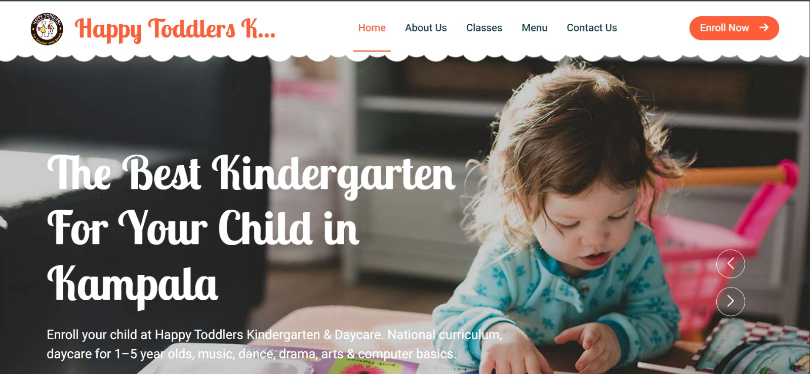
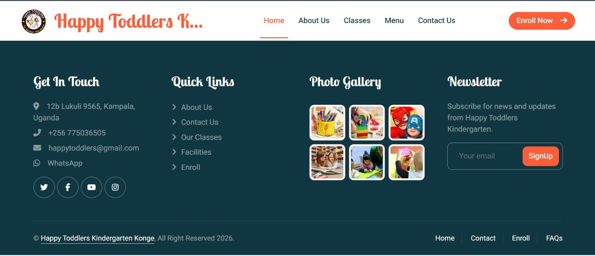

<div align="center">

# 🏫 Happy Toddlers Kindergarten Konge

> **Where Happy Learning Begins** ✨

*Our Vision: To provide a strong foundation that stimulates early learning and child care experiences, promoting excellence in child growth and development.*

[](https://github.com/codetherapistpita-oss/happytoddlerskindergarten)
[](LICENSE)

---

### 🛠️ Tech Stack


**Frameworks & Libraries:** Bootstrap 5 • Owl Carousel • WOW.js • jQuery • Easing.js • Waypoints

---

### 📸 Preview

<table>
  <tr>
    <td align="center">
      
      <br/>
      <em>✨ Home / Welcome</em>
    </td>
    <td align="center">
      
      <br/>
      <em>✨ Website Preview</em>
    </td>
  </tr>
</table>

---

### ✨ Features

| Feature | Description |
| :---: | --- |
| 📱 | **Fully Responsive** — Desktop, tablet & mobile |
| 🎨 | **Modern UI** — Clean design with animations |
| 🏫 | **School Facilities** — Transport, play areas, meals |
| 📚 | **Our Classes** — Art, Computer, Language & more |
| 👩‍🏫 | **Meet Our Teachers** — Dedicated team profiles |
| 📝 | **Enrollment** — Simple appointment form |
| 📞 | **Contact** — Phone, email, WhatsApp, location |

---

### 📍 Location

**📍 12b Lukuli 9565, Kampala, Uganda**  
📞 +256 775036505 • ✉️ happytoddlers@gmail.com

---

### 🚀 Quick Start

```bash
# Clone the repository
git clone https://github.com/codetherapistpita-oss/happytoddlerskindergarten.git

# Open in browser (or use XAMPP / Live Server)
# Navigate to index.html
```

---

### 👨‍💻 Designed & Developed by

<table align="center">
  <tr>
    <td align="center">
      
      <br/><br/>
      <strong>Peter Gyagenda</strong>
      <br/>
      <em>Code Therapist • Full Stack Developer</em>
      <br/><br/>
      <em>Passionate developer with a keen eye for design. Designed, developed & implemented this website.</em>
      <br/><br/>
      <a href="https://github.com/codetherapistpita-oss" target="_blank"></a>
      <a href="https://linkedin.com/in/code-therapist-1142243b5" target="_blank"></a>
      <a href="https://codetherapistpita-oss.github.io/codetherapist-portfolio/" target="_blank"></a>
      <a href="https://x.com/1codetherapist" target="_blank"></a>
      <a href="https://youtube.com/@codetherapist-m5d" target="_blank"></a>
    </td>
  </tr>
</table>

---

<p align="center">
  <strong>© Happy Toddlers Kindergarten Konge — All Rights Reserved 2026</strong>
</p>

</div>
